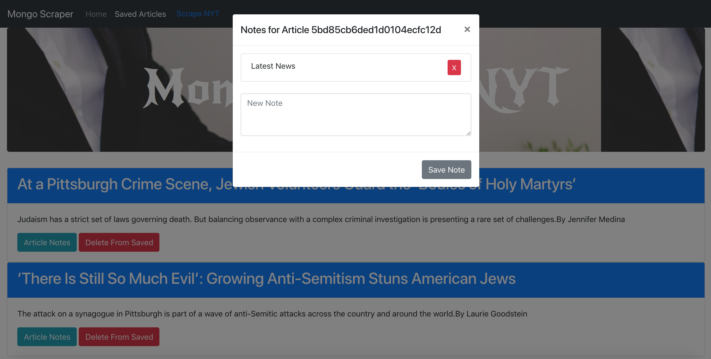

# Mongo Scraper

An app that uses cheerio and mongoose packages to scrape New York Times site. It display articles and allows them to be saved. Once saved visitors can add comments, and delete them.

## Getting Started

* Make sure Node.js and MongoDB are installed on your local machine.

### Installing

* Make sure Node.js and MongoDB are installed on your local machine.
* Clone this repo to your local machine ( you can do it py pasting this command in your Terminal "git clone https://github.com/VitoDaniel/mongoScraper.git" ) 
* Navigate to folder and run 'npm install to install the npm dependencies from the package.json file.
* Run 'mongod' on your computer
* Run 'node server.js' the console should log the port number the app will be on (currently 8080).
* Navigate to http://localhost:8080/ in yuour local browser to view app.

## Built With

* Node.js
* JavaScript
* jQuery
* Bootstrap
* HTML/CSS
* Body-parser NPM Package(https://www.npmjs.com/package/body-parser)
* MYSQL NPM Package (https://www.npmjs.com/package/mysql)
* Express NPM Package (https://www.npmjs.com/package/express)
* Handlebars NPM Package (https://www.npmjs.com/package/handlebars)
* Mongoose NPM Package(https://www.npmjs.com/package/mongoose)
* Cheerio NPM Package(https://www.npmjs.com/package/cheerio)

## Deployment

Visit live on Heroku : https://arcane-sands-73318.herokuapp.com/

